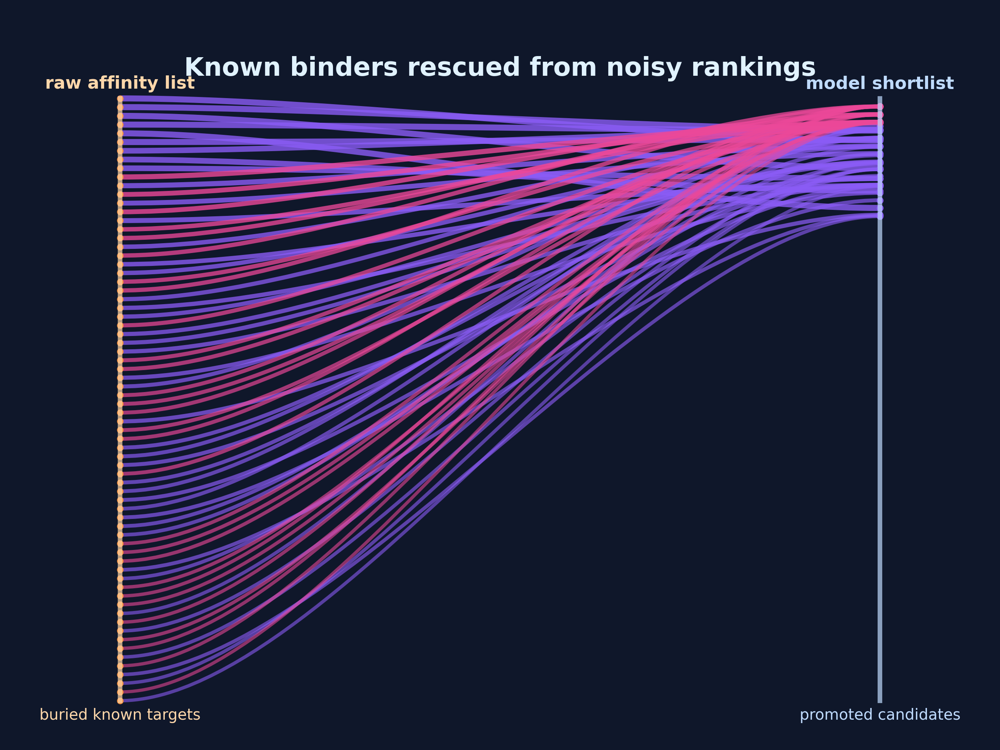
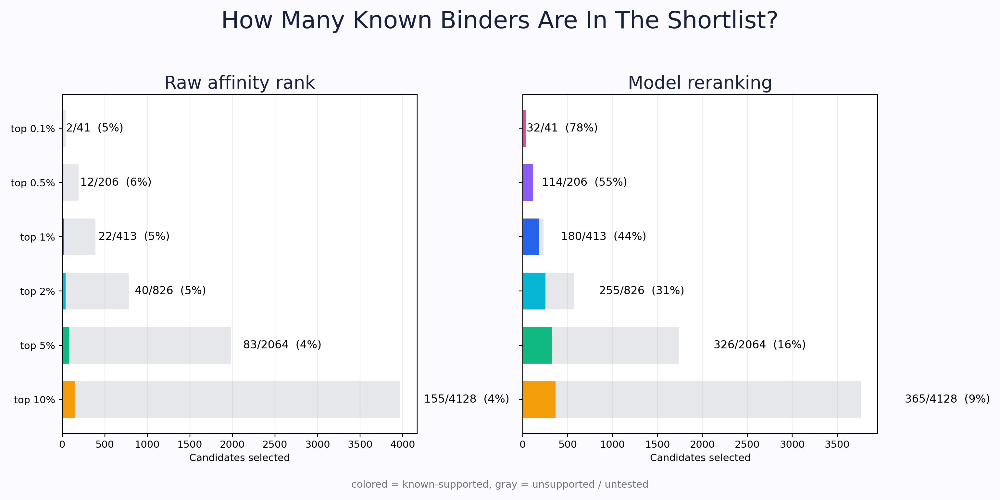
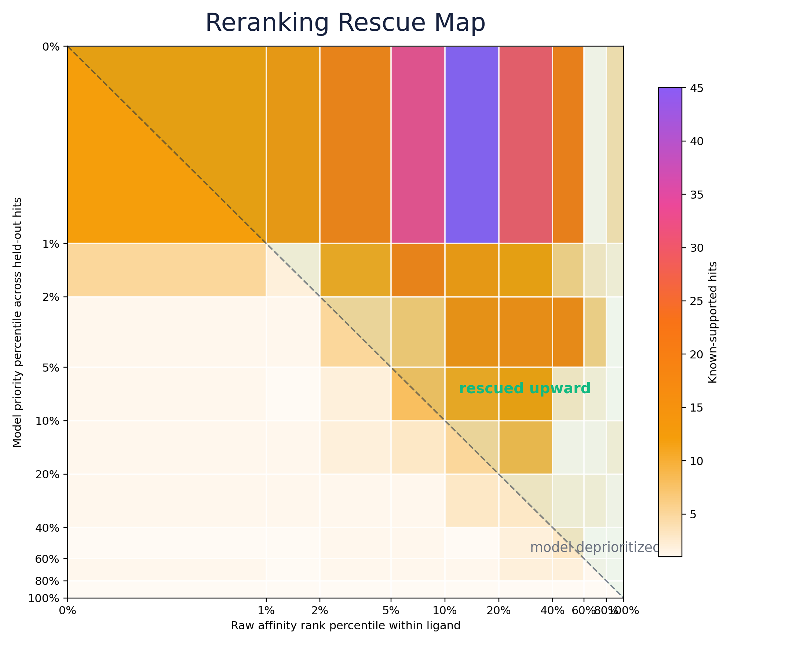

# Affinity List Reranking: Summary of What We Did

This note summarizes the current answer to the original affinity-list question:

> Given a ligand affinity file, how far down the ranked affinity list should we
> look, what fraction of the entries above a known binder are false positives,
> and can we use the affinity lists to prioritize plausible new ligand-target
> pairs?

Repository: <https://github.com/rks277/roshan-psb-2026>

## Executive Summary

Raw docking/affinity rank alone is noisy. Known Yamanishi targets are often not
ranked first, and in many cases they are buried thousands of rows down the
affinity list.

However, the affinity lists are not useless. When we convert each affinity-list
entry into a candidate `ligand + target` hit and rerank using a model that
combines affinity-rank context, ligand chemistry, and target biology, the top
shortlist becomes strongly enriched for known Yamanishi/BindingDB-supported
pairs.

Key clean result on ligand-held-out evaluation, excluding label-context prior
features:

```text
baseline known-support rate:        1.0%
top 0.5% by raw affinity rank:       5.8% known-supported
top 0.5% by model reranking:        55.3% known-supported
top 1.0% by raw affinity rank:       5.3% known-supported
top 1.0% by model reranking:        43.6% known-supported
```

The current model should be interpreted as a prioritization/reranking tool, not
as a final proof that a pair binds.

Methodology note: we ran an ablation removing the label-context prior features
(`ligand_yamanishi_degree_any`, `target_yamanishi_degree_any`,
`target_in_yamanishi_universe`, and `target_in_bindingdb_universe`). After that
removal, rank-only performance collapses. Adding richer ligand chemistry and
protein sequence-composition features recovers much of the top-shortlist
performance without those suspicious features. The current clean full model
reaches PR-AUC `0.391`, with the top 0.5% of scored held-out hits at `55.3%`
known-supported and the top 1.0% at `43.6%`, versus the `1.0%` baseline. This is
the more defensible estimate of signal not driven by dataset-prior features.

## The Most Useful Visuals

### 1. Reranking Rescue Ribbons

This is the most intuitive presentation figure. Each curve is a known-supported
ligand-target pair that was relatively buried in the raw affinity ranking and
then promoted by the clean model.



Source:

- [plot_affinity_reranking_story.py](../scripts/plot_affinity_reranking_story.py)
- [affinity_reranking_rescue_ribbons.png](../results/plots/affinity_reranking_rescue_ribbons.png)

### 2. Priority Funnel

This is the clearest quantitative figure. The gray bars are all selected
candidates; the colored part is the subset already supported by Yamanishi or
BindingDB. This figure was regenerated from the clean no-prior model.



Source:

- [affinity_reranking_priority_funnel.png](../results/plots/affinity_reranking_priority_funnel.png)

### 3. Rescue Map

This heatmap shows where known-supported hits move after clean reranking. Hits
above the diagonal were promoted by the model relative to raw affinity rank.



Source:

- [affinity_reranking_rescue_map.png](../results/plots/affinity_reranking_rescue_map.png)

## Point 1: How Far Down the Raw Affinity List Should We Look?

If we use raw affinity rank alone, there is no clean cutoff.

Among Yamanishi positives that could be mapped into the affinity files:

```text
ranked known positives: 2,721
median known-target rank: 1,325
75th percentile rank: 2,770
90th percentile rank: 4,397
95th percentile rank: 5,727
known target at rank 1: 4 pairs
```

So the known target is often far below the top of the raw docking list.

Raw-rank recall is very low:

| Raw rank cutoff | Known positives captured | Recall |
|---:|---:|---:|
| 1 | 4 | 0.15% |
| 10 | 35 | 1.29% |
| 20 | 55 | 2.02% |
| 50 | 100 | 3.68% |
| 100 | 160 | 5.88% |
| 200 | 290 | 10.66% |

Code and data:

- [analyze_affinity_rank_positions.py](../scripts/analyze_affinity_rank_positions.py)
- [affinity_rank_raw_summary.json](../results/affinity_rank_raw_summary.json)
- [affinity_rank_raw_cutoff_summary.csv](../results/affinity_rank_raw_cutoff_summary.csv)
- [affinity_rank_raw_known_positive_positions.csv](../results/affinity_rank_raw_known_positive_positions.csv)

## Point 2: What Percent of Higher-Ranked Targets Are False Positives?

Strictly, we cannot call them true false positives. Most are better described as
`unsupported` or `untested`, because absence from Yamanishi/BindingDB does not
prove non-binding.

Operationally, among targets ranked above known Yamanishi positives, almost all
are not currently supported by Yamanishi or BindingDB.

Examples from the raw rank analysis:

| Raw cutoff | Higher-ranked calls before known positive | Apparent unsupported fraction |
|---:|---:|---:|
| 10 | 138 | 92.8% |
| 20 | 432 | 97.0% |
| 50 | 1,997 | 98.6% |
| 100 | 6,637 | 98.9% |
| 200 | 25,908 | 99.3% |

Interpretation:

- If these are treated as true negatives, raw affinity rank looks very noisy.
- More likely, this is a positive-unlabeled problem: some of these pairs may be
  real but untested.
- Therefore, we should not discard the lists; we should use them as candidate
  generators and then rerank/prioritize.

Source:

- [affinity_rank_raw_cutoff_summary.csv](../results/affinity_rank_raw_cutoff_summary.csv)

## Point 3: Are the Affinity Lists Useless?

No. Raw rank alone is weak, but the lists contain useful signal when combined
with context.

The important distinction is:

```text
bad use:    take rank 1, or top 20, as predicted binders
better use: treat every row as a candidate and compute a hit-value score
```

The model learns which affinity-list entries resemble known supported
ligand-target interactions. It uses the affinity ranking as one input, not the
whole decision rule.

## Point 4: What Dataset Did We Build?

We built a compact per-hit dataset:

```text
one row = PubChem ligand CID + UniProt target + affinity/rank features + support label
```

Current compact dataset:

```text
rows:                         214,842
supported rows:                 2,862
unsupported / unlabeled rows: 211,980
ligand affinity lists:             665
```

The label is:

- `label_supported = 1`: the pair is supported by Yamanishi or BindingDB.
- `label_supported = 0`: the pair is not currently supported by those sources.

Important caveat: `0` means unlabeled/unsupported, not experimentally confirmed
non-binding.

Code and data:

- [build_affinity_hit_value_dataset.py](../scripts/build_affinity_hit_value_dataset.py)
- [affinity_hit_value_dataset_compact.csv](../data/processed/affinity_hit_value_dataset_compact.csv)
- [affinity_hit_value_dataset_summary.csv](../results/affinity_hit_value_dataset_summary.csv)

## Point 5: What Features Does the Reranking Model Use?

The initial best model used:

### Affinity/rank context

- raw affinity value
- raw rank
- rank percentile within ligand
- reverse rank percentile
- within-ligand affinity z-score
- robust within-ligand affinity z-score
- gap to next weaker affinity
- gap to previous stronger affinity
- total ranked UniProt targets in the ligand file
- ligand Yamanishi degree
- target Yamanishi degree
- whether target appears in the Yamanishi universe
- whether target appears in the BindingDB universe

### Ligand chemistry

- PubChem physicochemical descriptors
- MACCS fingerprints

### Target biology

- protein sequence length
- protein mass
- protein degree

We deliberately join chemistry/protein features at training time instead of
materializing a multi-GB wide CSV.

We then ran a clean ablation that removes the four label-context prior features:

- `ligand_yamanishi_degree_any`
- `target_yamanishi_degree_any`
- `target_in_yamanishi_universe`
- `target_in_bindingdb_universe`

That ablation is important because those four features can encode dataset
popularity. They help prioritize rows resembling already-labeled biology, but
they are not direct ligand-protein compatibility evidence.

Code:

- [train_affinity_hit_value_model.py](../scripts/train_affinity_hit_value_model.py)
- [build_no_affinity_dataset.py](../scripts/build_no_affinity_dataset.py)

## Point 6: What Model Did We Train and How Well Did It Work?

The earlier chemistry + biology reranking model, before removing label-prior
features, was:

```text
feature set: rank + PubChem + MACCS + target basic
classifier: Hist Gradient Boosting
split: ligand-held-out
features: 212
ROC-AUC: 0.988
PR-AUC: 0.539
baseline held-out support rate: 1.0%
```

Why ligand-held-out? It is stricter than a random row split because all rows for
a held-out ligand are excluded from training. That better tests whether the
reranking rule transfers to new ligand affinity files.

Metrics:

- [affinity_hit_value_maccs_biology_ligand_holdout_model_metrics.csv](../results/affinity_hit_value_maccs_biology_ligand_holdout_model_metrics.csv)
- [affinity_hit_value_maccs_biology_ligand_holdout_enrichment.csv](../results/affinity_hit_value_maccs_biology_ligand_holdout_enrichment.csv)
- [affinity_hit_value_maccs_biology_ligand_holdout_model_manifest.json](../results/affinity_hit_value_maccs_biology_ligand_holdout_model_manifest.json)

Clean ablation result, after removing label-prior features:

```text
feature set: clean rank + PubChem + MACCS + target basic
classifier: Hist Gradient Boosting
split: ligand-held-out
features: 208
ROC-AUC: 0.890
PR-AUC: 0.176
baseline held-out support rate: 1.0%
top 0.5% known-support rate: 32.5%
top 1.0% known-support rate: 23.0%
```

Expanded clean result, after adding Morgan fingerprints and protein
sequence-composition features:

```text
feature set: clean rank + PubChem + MACCS + Morgan + target sequence
classifier: Hist Gradient Boosting
split: ligand-held-out
features: 1,663
ROC-AUC: 0.948
PR-AUC: 0.391
baseline held-out support rate: 1.0%
top 0.1% known-support rate: 78.0%
top 0.5% known-support rate: 55.3%
top 1.0% known-support rate: 43.6%
```

We also tried explicit ligand-protein interaction terms such as
`XLogP x target hydrophobicity`, `TPSA x target polarity`, and
`affinity_zscore x target charged fraction`. They did not improve the held-out
result: PR-AUC dropped to `0.354`, so they are not the current main model.

The current publishable model-selection procedure is:

1. Hold out full ligands as the outer test set.
2. Split the remaining ligands again into inner training and validation ligands.
3. Select the model configuration on inner-validation PR-AUC.
4. Evaluate the selected model once on the outer held-out ligands.

In this tuning pass, default Hist Gradient Boosting beat class-balanced Hist
Gradient Boosting on the inner validation ligands:

```text
default HGB validation PR-AUC:   0.452
balanced HGB validation PR-AUC:  0.409
outer test PR-AUC after select:  0.391
```

Clean-ablation files:

- [affinity_hit_value_clean_ablation_ligand_holdout_model_metrics.csv](../results/affinity_hit_value_clean_ablation_ligand_holdout_model_metrics.csv)
- [affinity_hit_value_clean_ablation_ligand_holdout_enrichment.csv](../results/affinity_hit_value_clean_ablation_ligand_holdout_enrichment.csv)
- [affinity_hit_value_clean_ablation_ligand_holdout_model_manifest.json](../results/affinity_hit_value_clean_ablation_ligand_holdout_model_manifest.json)
- [affinity_hit_value_clean_full_ligand_holdout_model_metrics.csv](../results/affinity_hit_value_clean_full_ligand_holdout_model_metrics.csv)
- [affinity_hit_value_clean_full_ligand_holdout_enrichment.csv](../results/affinity_hit_value_clean_full_ligand_holdout_enrichment.csv)
- [affinity_hit_value_clean_full_best_ligand_holdout_scored_sample.csv](../results/affinity_hit_value_clean_full_best_ligand_holdout_scored_sample.csv)
- [affinity_hit_value_clean_tuned_fast_metrics.csv](../results/affinity_hit_value_clean_tuned_fast_metrics.csv)
- [affinity_hit_value_clean_tuned_fast_manifest.json](../results/affinity_hit_value_clean_tuned_fast_manifest.json)

## Point 7: How Should We Choose Good Affinity Pairs?

Use model reranking, not raw affinity rank alone.

Recommended workflow:

1. For a ligand, map the affinity file targets to UniProt.
2. Score every ligand-target row with the reranking model.
3. Sort by `hit_value_score` descending.
4. Prioritize the highest-scoring candidates for follow-up.
5. Treat unsupported high-scoring pairs as plausible novel candidates, not as
   confirmed positives.

The main scored output from the initial prior-context model is:

- [affinity_hit_value_maccs_biology_ligand_holdout_scored_sample.csv](../results/affinity_hit_value_maccs_biology_ligand_holdout_scored_sample.csv)

The recommended scored output that avoids label-prior/context features is:

- [affinity_hit_value_clean_full_best_ligand_holdout_scored_sample.csv](../results/affinity_hit_value_clean_full_best_ligand_holdout_scored_sample.csv)

Useful columns:

- `pubchem_cid`
- `uniprot_id`
- `affinity`
- `rank_1_based`
- `rank_percentile`
- `hit_value_score`
- `label_supported`

For new prediction/selection, `label_supported` is only for evaluation. The
selection column is `hit_value_score`.

## Point 8: What Operating Point Should We Use?

The best choice depends on experimental budget.

From ligand-held-out evaluation:

| Selection rule | Selected rows | Known-supported fraction | Enrichment over baseline |
|---|---:|---:|---:|
| top 0.1% by model score | 41 | 68.3% | 67.0x |
| top 0.5% by model score | 206 | 69.4% | 68.1x |
| top 1.0% by model score | 413 | 56.9% | 55.8x |
| top 2.0% by model score | 826 | 38.6% | 37.9x |
| top 5.0% by model score | 2,064 | 18.7% | 18.3x |
| top 10.0% by model score | 4,128 | 9.9% | 9.7x |

Practical recommendation:

- For a small validation set, start with the top 0.5%-1.0% by model score.
- For broader discovery, use bins: top 1%, 1-5%, 5-10%, and a raw-rank control.
- Include known positives as positive controls and unsupported high-score rows
  as discovery candidates.

Source:

- [affinity_hit_value_maccs_biology_ligand_holdout_enrichment.csv](../results/affinity_hit_value_maccs_biology_ligand_holdout_enrichment.csv)

## Point 9: What Does This Say About Hidden Positives?

This is a positive-unlabeled problem.

The model is trained with:

- positives: known Yamanishi or BindingDB ligand-target pairs
- unlabeled rows: everything else sampled from the affinity lists

Some unlabeled rows may be real binders that have not been tested. Therefore:

- We should not describe every unsupported row as a false positive.
- We should report `known-support rate` or `known-positive enrichment`.
- High-scoring unsupported rows are exactly the interesting experimental
  candidates.

## Point 10: What Has Been Pushed to GitHub?

Core code:

- [analyze_affinity_rank_positions.py](../scripts/analyze_affinity_rank_positions.py)
- [build_affinity_hit_value_dataset.py](../scripts/build_affinity_hit_value_dataset.py)
- [train_affinity_hit_value_model.py](../scripts/train_affinity_hit_value_model.py)
- [plot_affinity_reranking.py](../scripts/plot_affinity_reranking.py)
- [plot_affinity_reranking_story.py](../scripts/plot_affinity_reranking_story.py)

Core data/results:

- [affinity_hit_value_dataset_compact.csv](../data/processed/affinity_hit_value_dataset_compact.csv)
- [affinity_rank_raw_summary.json](../results/affinity_rank_raw_summary.json)
- [affinity_rank_raw_cutoff_summary.csv](../results/affinity_rank_raw_cutoff_summary.csv)
- [affinity_hit_value_maccs_biology_ligand_holdout_model_metrics.csv](../results/affinity_hit_value_maccs_biology_ligand_holdout_model_metrics.csv)
- [affinity_hit_value_maccs_biology_ligand_holdout_enrichment.csv](../results/affinity_hit_value_maccs_biology_ligand_holdout_enrichment.csv)
- [affinity_hit_value_maccs_biology_ligand_holdout_scored_sample.csv](../results/affinity_hit_value_maccs_biology_ligand_holdout_scored_sample.csv)

Figures:

- [affinity_reranking_rescue_ribbons.png](../results/plots/affinity_reranking_rescue_ribbons.png)
- [affinity_reranking_priority_funnel.png](../results/plots/affinity_reranking_priority_funnel.png)
- [affinity_reranking_rescue_map.png](../results/plots/affinity_reranking_rescue_map.png)
- [affinity_reranking_enrichment_curve.png](../results/plots/affinity_reranking_enrichment_curve.png)
- [affinity_reranking_top_fraction_bars.png](../results/plots/affinity_reranking_top_fraction_bars.png)

## Bottom Line

The affinity lists are valuable, but not as direct rank-ordered truth. The most
defensible use is:

```text
affinity file -> UniProt candidate list -> chemistry/biology-aware reranking -> experimental shortlist
```

This gives a formal way to decide how far down the list to look: choose a model
score operating point based on experimental budget, rather than using a fixed
raw affinity rank cutoff.
